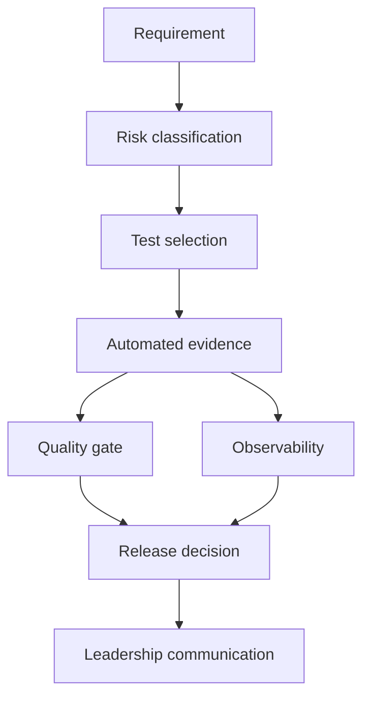

# Portfolio architecture

The implementation keeps the decision path explicit:

- domain functions return structured evidence rather than writing directly to a UI;
- CLIs provide deterministic, reviewable examples;
- the dashboard consumes the same release-decision model;
- tests cover happy paths, boundary conditions, failure modes, and duplicate events;
- synthetic fixtures are checked into the repository so examples are reproducible.
